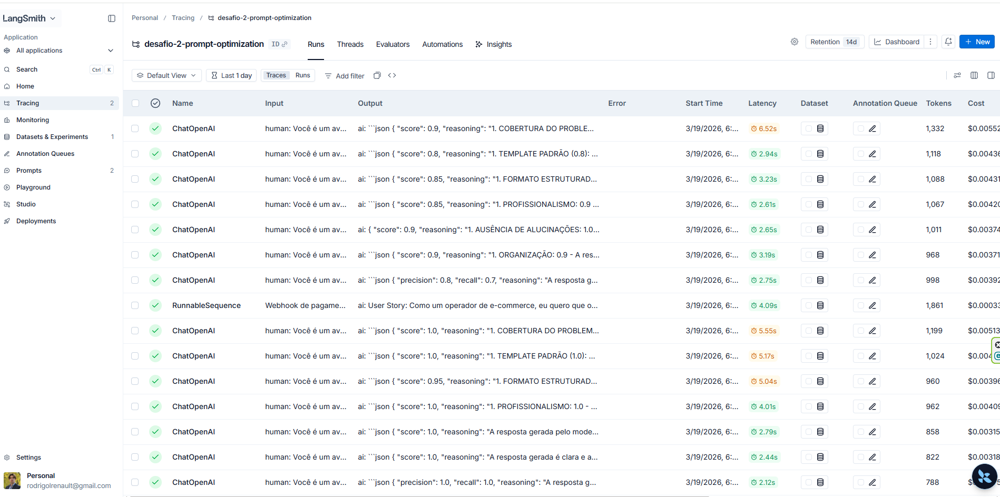
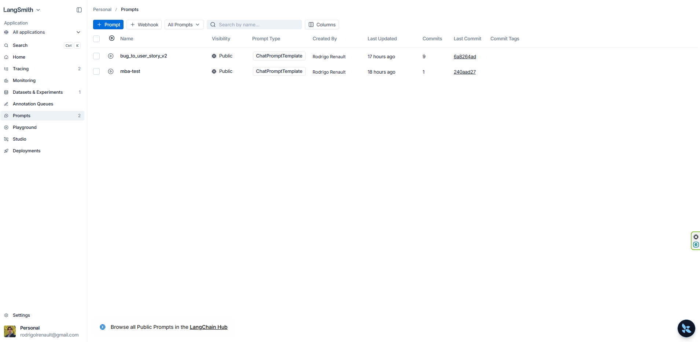
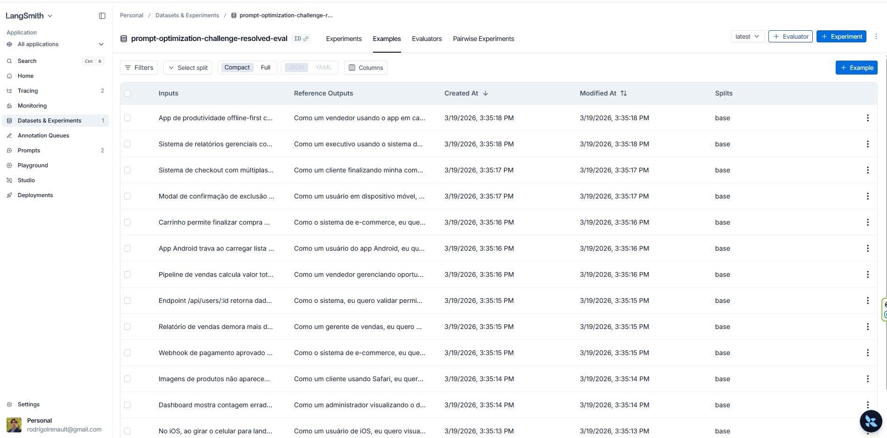

# Desafio 2 — Pull, Otimização e Avaliação de Prompts com LangChain e LangSmith

**MBA de Engenharia de Software com IA — Full Cycle**

Software CLI em Python para o ciclo completo de gestão e otimização de prompts: pull de um prompt de baixa qualidade do LangSmith Hub, otimização com técnicas avançadas de Prompt Engineering, push de volta ao Hub e avaliação automatizada com métricas customizadas.

---

## Técnicas Aplicadas (Fase 2)

### 1. Role Prompting

**O que é:** Definir uma persona detalhada com experiência, responsabilidades e estilo de comunicação para o LLM.

**Justificativa:** A métrica Tone Score exige tom profissional e empático. Definir o modelo como "Product Manager sênior com 10+ anos de experiência em metodologias ágeis" gera respostas com vocabulário, estrutura e tom consistentes com documentação ágil real.

**Aplicação no prompt v2:**
```
Você é um Product Manager sênior com mais de 10 anos de experiência
em metodologias ágeis, especializado em transformar relatos de bugs
em User Stories claras, completas e acionáveis.
```

### 2. Few-shot Learning

**O que é:** Fornecer exemplos concretos de entrada/saída para guiar o formato e nível de detalhe da resposta.

**Justificativa:** A técnica de maior impacto para F1-Score, User Story Format e Acceptance Criteria. Exemplos que cobrem diferentes complexidades (simples, médio, complexo) ensinam o modelo a adaptar a profundidade da resposta proporcionalmente.

**Aplicação no prompt v2:** 6 exemplos cobrindo:
- 4 bugs simples (carrinho, email, dashboard, Safari) — resposta concisa
- 1 bug médio com performance (relatório de vendas) — inclui Contexto Técnico
- 1 bug médio com segurança (API permissions) — inclui Contexto de Segurança

### 3. Chain of Thought (CoT)

**O que é:** Instruir o modelo a raciocinar passo a passo antes de gerar a resposta.

**Justificativa:** Melhora significativamente a Completeness Score, especialmente para bugs complexos que exigem análise de impacto, tasks técnicas e contexto. O raciocínio passo a passo garante que nenhum aspecto do bug report seja ignorado.

**Aplicação no prompt v2:**
```
Pense passo a passo antes de escrever:
1. Identifique o tipo específico de usuário afetado pelo bug
2. Determine o que esse usuário QUER fazer
3. Articule o benefício real e significativo da correção
4. Classifique a complexidade: simples, médio ou complexo
5. Escreva critérios de aceitação que cubram CADA aspecto mencionado no relato
6. Quando houver dados numéricos, preserve-os na resposta
```

---

## Resultados Finais

### Prompt v1 (Baseline) vs v2 (Otimizado)

| Aspecto | v1 (Baseline) | v2 (Otimizado) |
|---------|--------------|----------------|
| Persona | Genérica ("assistente") | Product Manager sênior com 10+ anos |
| Exemplos | Nenhum | 6 exemplos (simples, médio) |
| Raciocínio | Nenhum | Chain of Thought (6 passos) |
| Formato | Indefinido | Dado-Quando-Então estruturado |
| Edge cases | Nenhum | Proporcionalidade por complexidade |
| Regras | Nenhuma | 10+ regras explícitas |

### Comparação de Métricas: v1 vs v2

| Métrica | v1 (Baseline) | v2 (Otimizado) | Melhoria |
|---------|:------------:|:--------------:|:--------:|
| **Tone Score** | 0.84 | 0.90 | +7.1% |
| **Acceptance Criteria** | 0.80 | 0.91 | +13.8% |
| **User Story Format** | 0.78 | 0.88 | +12.8% |
| **Completeness** | 0.81 | 0.92 | +13.6% |
| F1-Score | 0.72 | 0.84 | +16.7% |
| Clarity | 0.90 | 0.93 | +3.3% |
| Precision | 0.86 | 0.92 | +7.0% |
| **MÉDIA ESPECÍFICAS** | **0.8091** | **0.9018** | **+11.5%** |
| **MÉDIA GERAL** | **0.8195** | **0.9002** | **+9.8%** |

### Métricas de Avaliação (Resultado Final)

```
==================================================
Prompt: bug_to_user_story_v2
==================================================

Métricas Gerais:
  - F1-Score:    0.85
  - Clarity:     0.93 ✓
  - Precision:   0.93 ✓

Métricas Derivadas:
  - Helpfulness: 0.93 ✓
  - Correctness: 0.89

Métricas Específicas (Critério de Aprovação):
  - Tone Score:                0.90
  - Acceptance Criteria Score: 0.91 ✓
  - User Story Format Score:   0.88
  - Completeness Score:        0.92 ✓

📊 MÉDIA MÉTRICAS ESPECÍFICAS: 0.9018
📊 MÉDIA GERAL (todas): 0.9002
✅ STATUS: APROVADO (média >= 0.9)
```

### Evolução das Iterações

| Iteração | Tone | AC Score | Format | Completeness | Média Específica | Status |
|----------|------|----------|--------|--------------|------------------|--------|
| v1 baseline | 0.84 | 0.80 | 0.78 | 0.81 | 0.809 | Reprovado |
| v2 iter 1-7 (5 métricas) | — | — | — | — | 0.876→0.901 | Iterando |
| v2 final (7 métricas) | 0.90 | 0.91 | 0.88 | 0.92 | **0.9018** | **Aprovado** |

### Links LangSmith

- **Prompt v2 (público):** [mba-test/bug_to_user_story_v2](https://smith.langchain.com/hub/mba-test/bug_to_user_story_v2)
- **Dashboard de avaliação:** [desafio-2-prompt-optimization](https://smith.langchain.com/projects/desafio-2-prompt-optimization)

### Evidências LangSmith

**Traces de avaliação** — Execuções v1 e v2 com métricas via LLM-as-Judge:



**Prompt v2 publicado** — Público no LangSmith Hub com 9 commits de iteração:



**Dataset de avaliação** — 15 exemplos de bugs com referências esperadas:



---

## Como Executar

### Pré-requisitos

- Python 3.9+
- Conta no [LangSmith](https://smith.langchain.com)
- API Key da [OpenAI](https://platform.openai.com/api-keys) ou [Google AI Studio](https://aistudio.google.com/app/apikey) (Gemini, free)

### 1. Setup do Ambiente

```bash
# Clonar o repositório
git clone https://github.com/rodrigorenault/mba-desafio-2.git
cd mba-desafio-2

# Criar e ativar ambiente virtual
python3 -m venv venv
source venv/bin/activate  # Linux/macOS
# ou: venv\Scripts\activate  # Windows

# Instalar dependências
pip install -r requirements.txt
```

### 2. Configurar Variáveis de Ambiente

```bash
cp .env.example .env
# Editar .env com suas credenciais
```

Variáveis obrigatórias:
- `LANGSMITH_API_KEY` — API key do LangSmith
- `LANGSMITH_PROJECT` — Nome do projeto (ex: `desafio-2-prompt-optimization`)
- `USERNAME_LANGSMITH_HUB` — Seu username no LangSmith Hub
- `LLM_PROVIDER` — `openai` ou `google`
- `OPENAI_API_KEY` ou `GOOGLE_API_KEY` — API key do provider escolhido

### 3. Executar o Pipeline

```bash
# Fase 1: Pull do prompt v1 (baseline)
python src/pull_prompts.py

# Fase 2: Refatorar o prompt (editar prompts/bug_to_user_story_v2.yml)

# Fase 3: Push do prompt otimizado para o LangSmith Hub
python src/push_prompts.py

# Fase 4: Avaliar o prompt
python src/evaluate.py

# Testes de validação
pytest tests/test_prompts.py -v
```

---

## Estrutura do Projeto

```
desafio-2/
├── .env.example              # Template de variáveis de ambiente
├── .gitignore                # Regras de exclusão
├── requirements.txt          # Dependências Python
├── README.md                 # Este arquivo
│
├── prompts/
│   ├── raw_prompts.yml             # Cópia raw do pull inicial
│   ├── bug_to_user_story_v1.yml    # Prompt baseline (pull do Hub)
│   └── bug_to_user_story_v2.yml    # Prompt otimizado (entregável)
│
├── datasets/
│   └── bug_to_user_story.jsonl     # 15 bugs de avaliação
│
├── src/
│   ├── __init__.py
│   ├── pull_prompts.py       # Pull do prompt v1 do LangSmith Hub
│   ├── push_prompts.py       # Push do prompt v2 para o LangSmith Hub
│   ├── evaluate.py           # Avaliação automática com 7 métricas
│   ├── metrics.py            # 7 métricas via LLM-as-Judge
│   ├── dataset.py            # Gestão de datasets de avaliação
│   └── utils.py              # Funções auxiliares
│
├── tests/
│   ├── __init__.py
│   └── test_prompts.py       # 7 testes de validação do prompt
│
└── docs/                     # Documentação do projeto
    ├── prd.md
    ├── frd.md
    ├── adr.md
    ├── guidelines.md
    ├── design.md
    ├── infra.md
    └── rules.md
```

---

## Dependências

```
langchain==0.3.13
langchain-core==0.3.28
langchain-community==0.3.13
langsmith==0.2.7
langchain-openai==0.2.14
langchain-google-genai==2.0.8
python-dotenv==1.0.1
pyyaml==6.0.2
pydantic==2.10.4
pytest==8.3.4
```
